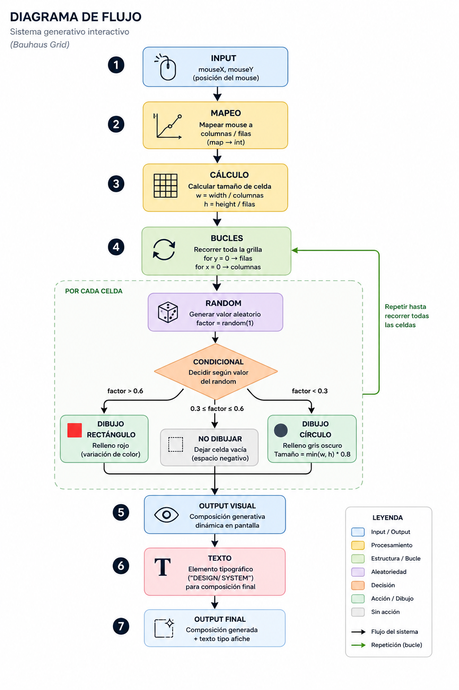

> ⚠️ **Importante**
>
> Este repositorio es solo para ejemplificar un proyecto de solemne II. Usar solo para referencia de **código, el funcionamiento del sistema y de diagrama de flujo**.
>
> **NO es un modelo de cómo deben hacer su README ni la estructura de su repositorio.**
>
> Úsenlo como referencia para:
> - entender la lógica del sistema  
> - ver cómo se relacionan input, proceso y output  
> - revisar un ejemplo de diagrama de flujo  
>
> Cada estudiante debe desarrollar su propio proyecto, documentación y organización del repositorio según las instrucciones de la Solemne II.

# Ejemplo Solemne II

- [link editable a p5js](https://editor.p5js.org/sofialuisa.xyz/sketches/NwXr2fEIj) con código y sketch corriendo. 
- [visor pantalla completa](https://editor.p5js.org/sofialuisa.xyz/full/NwXr2fEIj) de sketch.

## Por qué este proyecto cumple con los requisitos:

Es un sistema generativo que crea composiciones visuales tipo afiche inspiradas en la Bauhaus.  
No copia una estética, sino que traduce principios de diseño a un sistema computacional.

El sistema:
- Utiliza una **grilla como estructura base**
- Emplea **formas geométricas simples** (rectángulos, círculos y texto)
- Usa **color limitado e intencional** acorde al referente
- Responde de forma continua al mouse:
  - `mouseX` → controla columnas  
  - `mouseY` → controla filas  
- Genera variaciones en cada ejecución mediante **reglas y aleatoriedad**

## Sistema generativo

El comportamiento se construye a partir de:

- **Repetición** → bucles `for` recorren la grilla  
- **Reglas** → condicionales `if` definen qué dibujar  
- **Variación** → `random()` cambia el resultado en cada celda  
- **Transformación** → `map()` convierte input en estructura visual  
- Esto produce un sistema dinámico: mismo código, resultados distintos.

## Ejemplo diagrama de flujos

 

**no es necesario agregar íconos a cada sección, con la leyenda basta.*
*Más ejemplos y recursos disponibles en los siguientes links:*
- [tutorial simple de diagramas de flujo](https://www.youtube.com/watch?v=hTz4YzvtjrM)
- [plantillas de diagramas de flujo en Canva](https://www.canva.com/es_mx/pizarra-digital/diagramas-flujo/)
- [plantillas de diagramas de flujo en Figma](https://www.figma.com/es-la/comunidad/diagramacion/diagramas-de-flujo)

## Requisitos técnicos

El proyecto cumple con los mínimos requeridos:

- Variables propias (`columnas`, `filas`, etc.)  
- Condicionales (`if / else`)  
- Bucles (`for`)  
- Función propia (`dibujarGrilla`, `dibujarTexto`)  
- Uso de `map()` y `random()`  
- Input continuo (mouse)  
- Output visual dinámico y reactivo  

## Otro ejemplo de sistema generativo (sólo código y visualización):
[Ejemplo 2 - Solemne II / Sólo código y visualización](https://editor.p5js.org/sofialuisa.xyz/sketches/X_vurzNbb)
